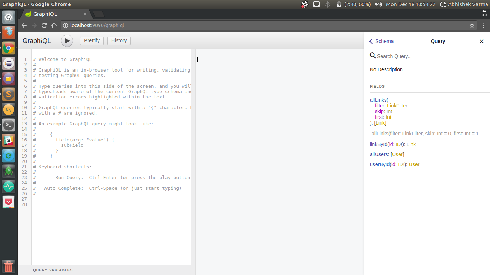
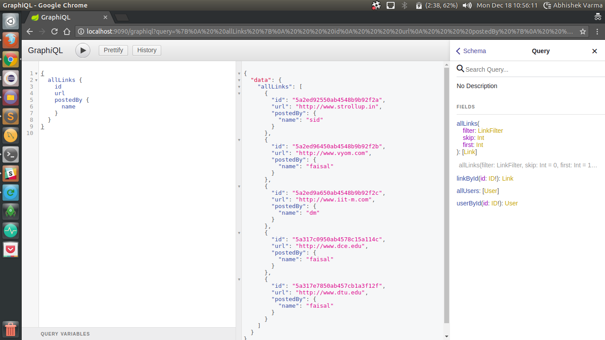

# GraphQL-SpringBoot  
This is an implementation of Fb's GraphQL in java using spring-boot and gradle. It shows how to create a GraphQL server for a micro-blogging web-app where a user can be created, then login and post links which can be voted by other users.

## How to setup and execute
 - [read HOWTO.md](HOWTO.md)
 - [APIs](https://www.getpostman.com/collections/be1d19307f5c34c13f5d)

## Screenshots
### GraphiQL

  
  
### Debugging with GraphiQL

  
